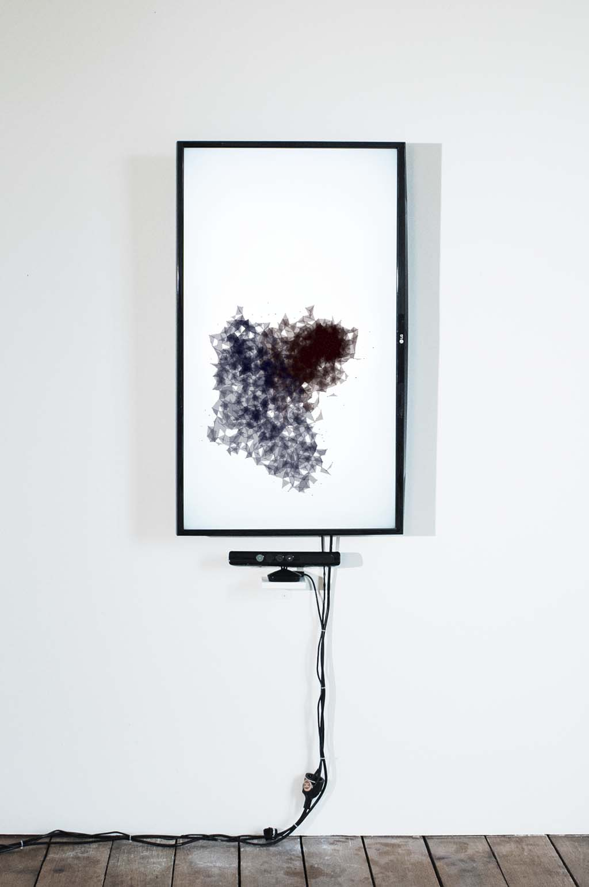
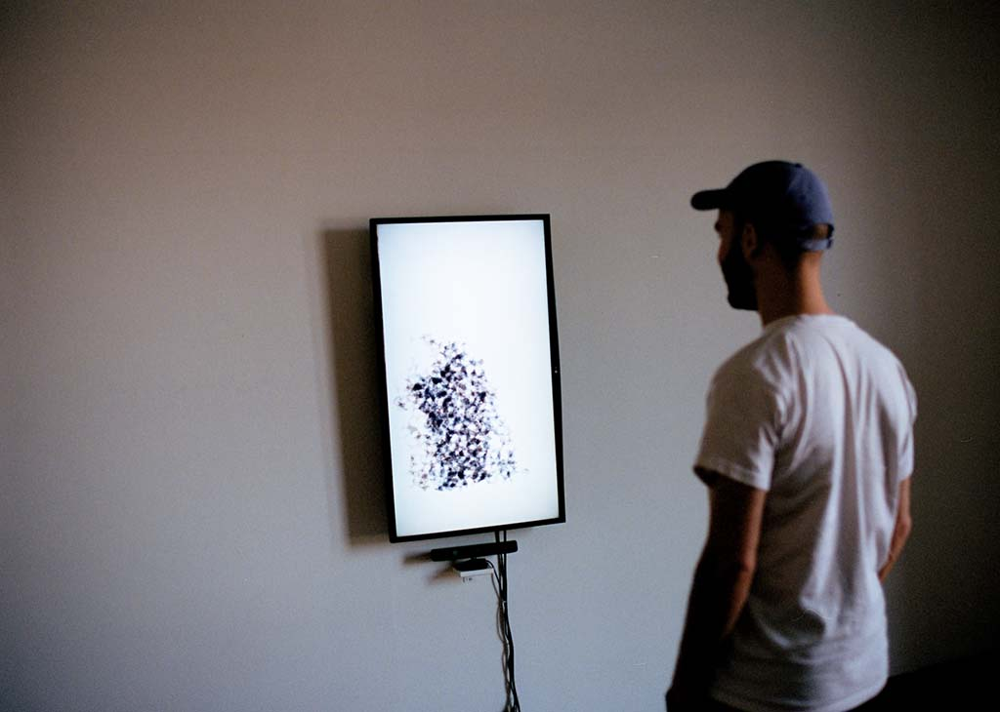
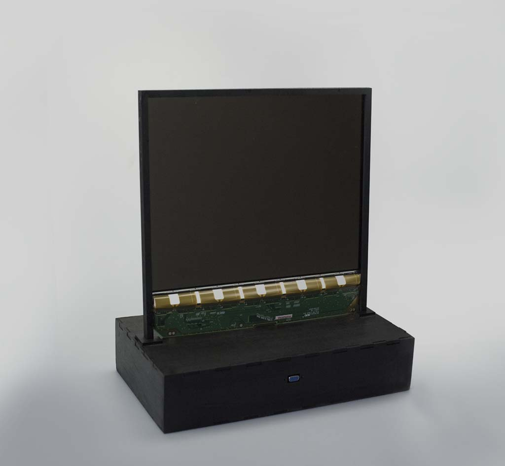
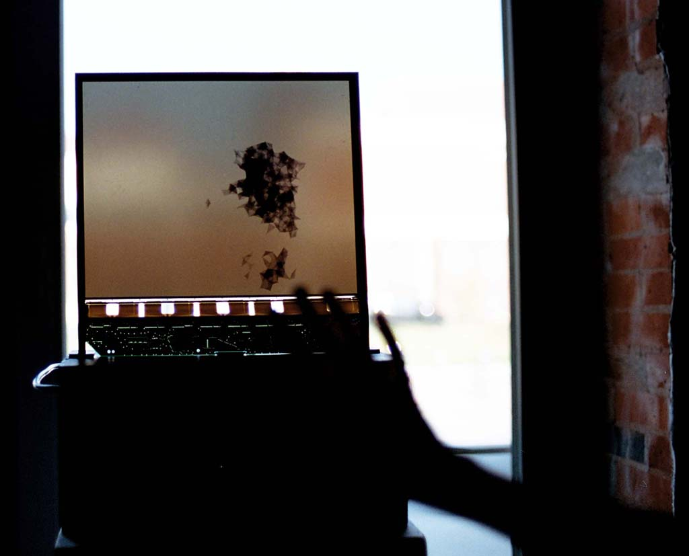

# just noticeable communication

* category: master project
* student/s: felix wagner
* course title: master project
* lecturer/s: ralf baecker, peter von maydell, dennis paul, petra klusmeyer, roland kerstein
* year: ws 2017/18

Immediate communication is ubiquitous and ruling the pace and way of how every digital dialogue is led. Realizing subtle positions and emotional states in a conversation under the restrictions of digitality is impossible and becomes a persuasive game of guessing. *just noticeable communication* explores the borders of distinguishability and is playing with self-awareness and recognition of others to decelerate a digital conversation.

<!---->

The work is an interactive installation at two separate places. Each place is equipped with one vertically mounted screen as well as a kinect depth sensor (as shown above). Spectators stepping in front of the installation are getting reproduced as a lively silhouette consisting out of a swarm of dots and triangles. Each dot is moving autonomously reacting to its neighbours as well as to an underlying invisible particle mesh created through the depth data of the kinect sensor. As a result, the created silhouette has its movement pattern and reaction speed. Each sensor and screen is creating one silhouette, one in blue color, one in red. The resulting interaction between the autonomously moving silhouette/s and the spectator/s is planned to happen in three stages:

1. the spectator recognizes his/her own representation
2. the spectator realizes another person's image
3. the spectator starts communicating with the other spectator or with his own silhouette

## the translucent screen

Initially it was planned to make the actual screen on which the whole piece is presented on a part of the work itself. Sadly I did not manage to build a screen of the size that is actually suiteable for my piece, so I can only reveal my prototype.

*The translucent screen* consists of a reused old LCD panel which is hanging in a frame isolated from all PCB's and its PSU. It is still a fully functional computer screen an can be used on every device capable of supplying data via VGA port.

